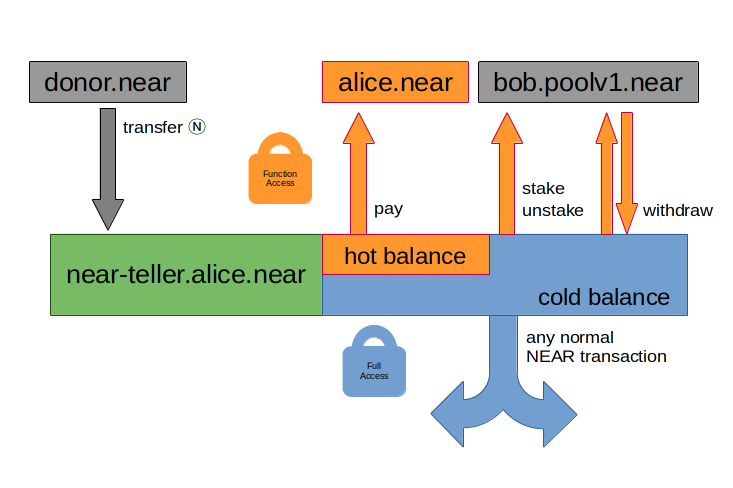
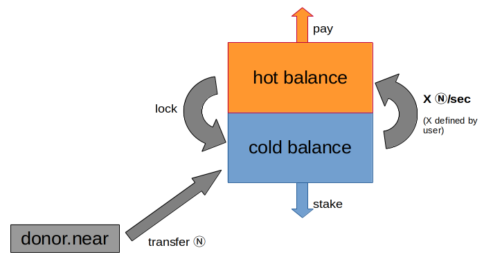

# NEAR Teller

NEAR Teller keeps the bulk of your tokens safe behind a full access key which
you should store in a cold wallet. You can then add a function access key that
allows unlimited staking and limited withdrawals from a hot wallet.

## Overview

Teller has the concept of hot and cold balance.
- The hot balance can be transferred out of the account using a function access key. This could be to one of your other accounts, or directly to a foreign account.
- The cold balance is only accessible for transfer using a full access key.

The purpose of this setup is that someone who gained access to your function access key could only access the hot balance.



You might notice staking, unstaking, and withdrawal operations performed on a
staking pool. This is done by calling methods on a [staking pool
contract](https://github.com/near/core-contracts/tree/master/staking-pool). This
will transfer tokens to the pool and stake with them.

One attack vector here is that someone could deploy fake staking pools. Only use
staking pools deployed through the
[factory](https://github.com/near/core-contracts/tree/master/staking-pool-factory)
which will be visible by the account being a subaccount of `poolv1.near`. If you
stake with another account, this will send your cold balance tokens there. If
the account is malicious, your tokens are lost and unrecoverable.

To prevent someone who got hold of your function access key to abuse the `stake`
method to transfer cold balance tokens to an account controlled by them, the
list of staking pools is statically compiled into the contract. It cannot be
changed without redeploying the contract. Redeploying of course requires a full
access key, which gives access to all tokens anyway.

### Moving between hot and cold balance

Cold balance is converted to hot balance at a constant rate. The exact rate can
be configured before deploying the contract.

If the hot balance is getting too large for your taste, manually call `lock` to
convert it back.



### Example use case

The intention here is for someone who receives NEAR token regularly (for example
salary or donations). One can then define how much they want to spend over a
period of time while saving the rest. And of course, while saving, the tokens
can be used for staking.

The tokens available to spend are called the hot balance and it increases
steadily. It can even go above the actual token balance. Of course transactions
that try to access more than available will fail. However, when more funds are
added to the account, they will immediately available if the hot balance was
already on that level.

This rest is called the cold balance. It is steadily decreasing and will
eventually reach zero unless more funds are added. Therefore, even if you
somehow lose access to the full access key, you will eventually gain have access
to all your tokens. How long it takes depends on the rate you defined and how
many tokens are stored inside near-teller.

## Contract Methods

- `hot()` is a view call that returns the balance in yocto Near currently
  available to access from a hot wallet.
- `pay(n: Near, a: AccountId)` and `pay_yocto(yocto: String, a: AccountId)` send
  tokens to an account and reduces the amount accessible from your hot wallet.
- `lock(n: Near)` and `lock_yocto(yocto: String)` reduce the amount accessible
  from your hot wallet.
- `stake(i: u32, n: Near)` and `stake_yocto(i: u32, yocto: String)` stake
  tokens with a staking pool without changing the amount accessible from your
  hot wallet.
- `unstake(i: u32)` unstakes all staked deposit at a staking pool, which will be
  available for withdrawal after a delay.
- `withdraw(i: u32)` claims unstaked deposit at a staking pool and makes it
  available for staking by teller once again. Does not change the hot token
  amount.

## Usage

1. Configure, compile and deploy this contract.
2. Add a function call key to your account that has itself as the receiver.
3. Store you full access key away safely in a cold wallet.
4. Use the function call key to manage tokens sent to your account.
    - Stake arbitrary amounts of tokens.
    - Retrieve a limited amount of tokens. The amount increases at a constant rate over time.

### Configure, compile, and deploy

Set parameters in [`config.ron`](./src/config.ron):

```rust
Config {
    // Set how many yocto NEAR per second should be available through function calls.
    nano_near_per_second: 100_000_000_000_000_000,
    // pick staking pools you trust
    // https://explorer.near.org/nodes/validators
    staking_pools: [
        "YOUR-FAVOURITE-VALIADTOR-0.poolv1.near",
        "YOUR-FAVOURITE-VALIADTOR-1.poolv1.near",
        "YOUR-FAVOURITE-VALIADTOR-2.poolv1.near",
        "YOUR-FAVOURITE-VALIADTOR-3.poolv1.near",
        "YOUR-FAVOURITE-VALIADTOR-4.poolv1.near",
        "YOUR-FAVOURITE-VALIADTOR-5.poolv1.near",
        "YOUR-FAVOURITE-VALIADTOR-6.poolv1.near",
        "YOUR-FAVOURITE-VALIADTOR-7.poolv1.near",
        "YOUR-FAVOURITE-VALIADTOR-8.poolv1.near",
        "YOUR-FAVOURITE-VALIADTOR-9.poolv1.near",
    ],
}
```

Then compile it using `make res/near_teller.wasm`.

The configuration options are now fixed inside the WASM.
They can only be changed by recompiling and redeploying.

Now simply deploy the WASM to you account.

```bash
# replace `teller.alice.testnet` with your account ID
ACCOUNT="teller.alice.testnet"
near deploy ${ACCOUNT} res/near_teller.wasm --initFunction "init" --initArgs '{}'
```

### Add a function call key

The key should be configured as function call access key with contract ID set to
the account itself and the methods argument left empty to signal that all
methods are allowed.

```bash
# replace `teller.alice.testnet` with your account ID
ACCOUNT="teller.alice.testnet"
# use a public key you control
#  - for example generated using `near generate-key`
#  - or maybe use an existing key, like one stored in your hardware wallet
KEY=ed25519:5UtgSAe72iuKzMYz9sXY9AqVnE16PiYmQKkRfCpsqJKw
# Actually add the key
near add-key ${ACCOUNT} --contract-id ${ACCOUNT} ${KEY}
```

### Note for developers

#### Code Architecture

```bash
src
├── lib.rs              # definition of smart contract state and API
├── implementation.rs   # business logic
├── error.rs            # error codes returned by `implementation.rs`
├── config.ron          # configuration of parameters assumed to change per user
└── unit_tests.rs       # tests only
```

To understand the code, have a look at `src/lib.rs` and `src/implementation.rs`.
The comments in the code modules are usually more up tp date than the readme. Be
sure to check the top of the files for a high-level summary of the module
design. But in essence, the split is that parsing happens in `lib.rs` and state
manipulation happens in `implementation.rs`.

#### Building

```bash
# basic compilation
cargo build -r -p near-teller --target wasm32-unknown-unknown
```

```bash
# compilation with extra binary size optimizations
# may require extra tools:
# - wasm-opt (`apt install binaryen` or https://github.com/WebAssembly/binaryen)
# - wasm-strip (`apt install wabt` or  https://github.com/WebAssembly/wabt)
make res/near_teller.wasm
```

#### Testing

To run tests, please use:
```bash
# this will rebuild the WASM and run tests on it
make test
```

The test code is split into
- unit tests (`src/unit_tests.rs`)
- integration tests (`tests/integration-tests.rs`)

Neither of those has full test coverage. Contributions are welcome!

### Limitations

This contract, on purpose, does now allow:
- staking with staking pools not listed in config
- changing configs without redeploying the entire contract

It would be possible to add such functionality in a fork, feel free to do so.
But this repository contains a minimal contract by design.

## Disclaimers

This is a private project by me, jakmeier, to learn and build a simple but useful
smart contract. It is not endorsed by any companies or organizations that I am
or was associated with. The code was not audited, either.

This is the first real smart contract I implemented. Hence I do not have the
necessary experience or expertise to write contracts that move larger amounts of
money than you are willing to lose. Use with discretion.

Under no circumstances shall contributors to this code base be liable for
damages caused direct or indirect by the code provided.

## License

Anyone is allowed to use this code as permitted by MIT license or the Apache
License (Version 2.0).

In layman's terms, do with this code anything you like. **But at your own risk.**